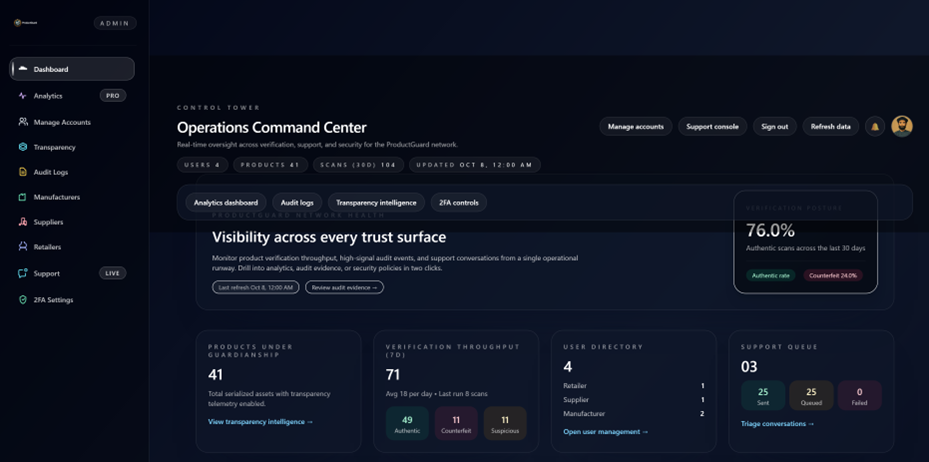
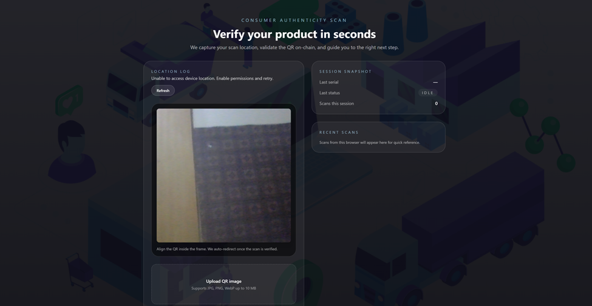
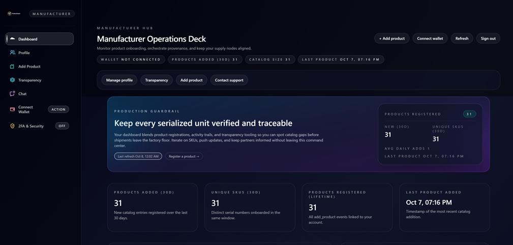
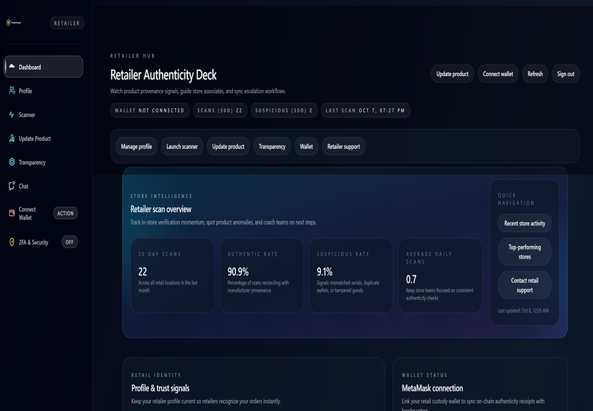
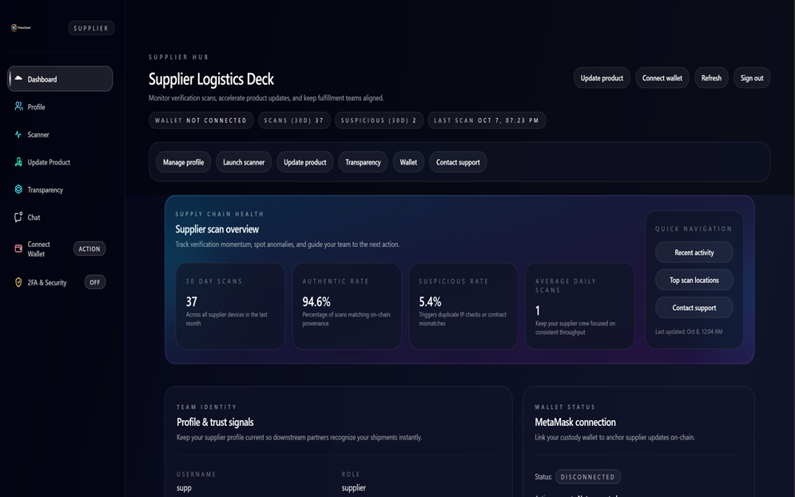
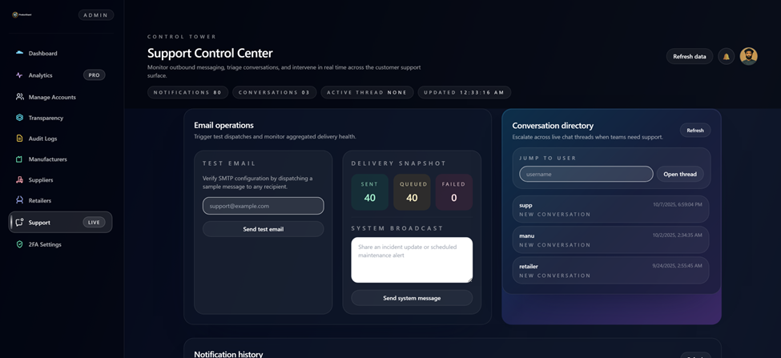

# ProductGuard

A blockchain-powered product authentication platform with a React frontend, Node/Express API, PostgreSQL database, and Ethereum smart contract integration (Hardhat).

## Table of contents

- Overview
- Key Features & Pages
- Tech stack & structure
- Screenshots
- Prerequisites
- Quick start
- Database setup (import SQL dump)
- Configuration (env vars)
- Run locally (backend, frontend, blockchain)
- Run Hardhat locally (blockchain)
- Common commands
- Troubleshooting
- Security notes
- License

## Overview

ProductGuard lets manufacturers register products on-chain and generate QR codes. Suppliers/retailers update product history while customers can scan a QR code to verify authenticity. The app includes an admin dashboard with comprehensive audit logs, analytics, role-based access, file uploads, and real-time monitoring.

**Key Features:**

- **Product Authentication**: Blockchain-powered product registration and QR code verification
- **Role-Based Access Control**: Separate interfaces for admins, manufacturers, suppliers, and retailers  
- **Advanced Audit Logs**: Comprehensive logging of all user activities, login attempts, and product scans with filtering and analytics
- **Real-Time Analytics**: Interactive dashboards showing scan trends, login success rates, and activity summaries
- **Customer Support**: Live chat system with Socket.IO integration
- **File Management**: Product image uploads with Multer
- **Security**: Parameterized SQL queries, input validation, and audit trails

## Tech stack & structure

- Frontend: React (CRA), Tailwind CSS, MUI, Axios, Ethers.js
- Backend: Node.js, Express, PostgreSQL, Multer, Socket.IO
- Blockchain: Hardhat, Solidity

Repository layout:

- frontend/ – React UI with role-based routing
- backend/ – Express API with audit logging, file uploads, Postgres client
- Blockchain/ – Smart contracts, Hardhat config
- sqldump.sql – Database schema with audit tables

## Key Features & Pages

**Admin Dashboard (`/admin`):**

- Real-time KPI cards (users, products, scans, authenticity rates)
- Weekly scan activity trends with visual progress bars
- Recent activity feed with action icons
- Top activities summary (7-day period)
- Login success rate monitoring
- Quick action buttons for common admin tasks

**Audit Logs Page (`/audit-logs`):**

- Advanced filtering by log type, username, time period, and specific criteria
- Interactive analytics charts for daily scan and login trends  
- CSV export functionality for compliance and reporting
- Real-time data with parameterized queries for security
- Visual indicators for authentic/counterfeit scans and login success/failure

**Role-Based Pages:**

- Manufacturers: Product registration with blockchain integration
- Suppliers: Supply chain updates and product history
- Retailers: Inventory management and customer-facing features
- Public: QR scanner with authenticity verification

## Screenshots

### Home Page


### Admin Control Tower


### Consumer Authenticity Verification


### Manufacturer Operations Deck


### Retailer Authenticity Deck


### Supplier Logistics Deck


### Support Control Center


## Prerequisites

- Node.js 18+ and npm
- PostgreSQL 14+ (or compatible)
- Git
- Optionally: MetaMask, Hardhat (for local blockchain)

## Quick start

1. Clone and install dependencies

```powershell
git clone <your-repo-url>
cd product
cd backend && npm install
cd ../frontend && npm install
cd ../Blockchain && npm install
```

1. Configure environment variables

Copy and edit env files using the examples in each folder.

```powershell
cd backend; copy .env.example .env; notepad .env
cd ../frontend; copy .env.example .env; notepad .env
```

1. Run backend and frontend

```powershell
# Backend
cd backend
npm start

# Frontend (in a new terminal)
cd frontend
npm start
```


## Configuration (env vars)

Backend (`backend/.env`):

```env
PORT=5000
PGHOST=localhost
PGUSER=postgres
PGPASSWORD=your_secret_password
PGDATABASE=postgres
PGPORT=5432
CORS_ORIGINS=http://localhost:3000
```

Frontend (`frontend/.env`):

```env
REACT_APP_API_BASE_URL=http://localhost:5000
REACT_APP_CONTRACT_ADDRESS=
REACT_APP_GOOGLE_MAPS_API_KEY=YOUR_GOOGLE_MAPS_API_KEY_HERE
```

Notes:

- The Google Maps key is used for reverse geocoding; you may omit it for local demos.
- The contract address should match your deployed contract on local Hardhat or a network.

## Run locally

Backend (Express):

```powershell
cd backend
npm start
```

Frontend (React):

```powershell
cd frontend
npm start
```

Blockchain (Hardhat):

```powershell
cd Blockchain
npm install
```

## Run Hardhat locally (blockchain)

1. Start a local Hardhat node (keep this terminal open)

```powershell
cd Blockchain
npx hardhat node
```

1. Deploy the contract to localhost in a new terminal

```powershell
cd Blockchain
npx hardhat run scripts/deploy.js --network localhost
```

## Documentation

- [1.3.5 Blockchain Transaction History Guide](docs/1.3.5-blockchain-transaction-history.md)
- [1.3.6 Analytical Reports & Dashboard Guide](docs/1.3.6-analytics-module-guide.md)

The deploy script will print the Identeefi contract address, for example:

```text
Identeefi address: 0xABCDEF...
```

1. Point the frontend to your deployed contract

- Edit `frontend/.env` and set `REACT_APP_CONTRACT_ADDRESS` to the printed address
- Restart the frontend dev server to pick up env changes

1. Optional: Use MetaMask with localhost

- Add a network in MetaMask named "Localhost 8545" with RPC URL <http://127.0.0.1:8545> and Chain ID `31337`
- Import a private key from the Hardhat node output (for testing only; never use these keys in production)

## Common commands

- Lint/fix (if configured): `npm run lint` / `npm run fix`
- Run tests (frontend): `cd frontend; npm test`
- Rebuild production: `cd frontend; npm run build`

## Troubleshooting

- Backend can’t connect to DB: verify `backend/.env` credentials and that PostgreSQL is running; import `sqldump.sql` if schema is missing.
- CORS issues: set `CORS_ORIGINS` to your frontend origin (e.g., <http://localhost:3000>).
- QR scanning/contract address mismatch: ensure `REACT_APP_CONTRACT_ADDRESS` matches the QR code that was generated.
- Google geocoding not working: supply a valid `REACT_APP_GOOGLE_MAPS_API_KEY` or leave it unset to disable reverse geocoding.

## Security notes

- Secrets and host URLs are managed via `.env` files and not hardcoded in source.
- Frontend env values are public by nature; restrict API keys at the provider level (domain, API, quotas) or proxy via backend when possible.

## License

This project is licensed under the MIT License - see the [LICENSE](LICENSE) file for details.
